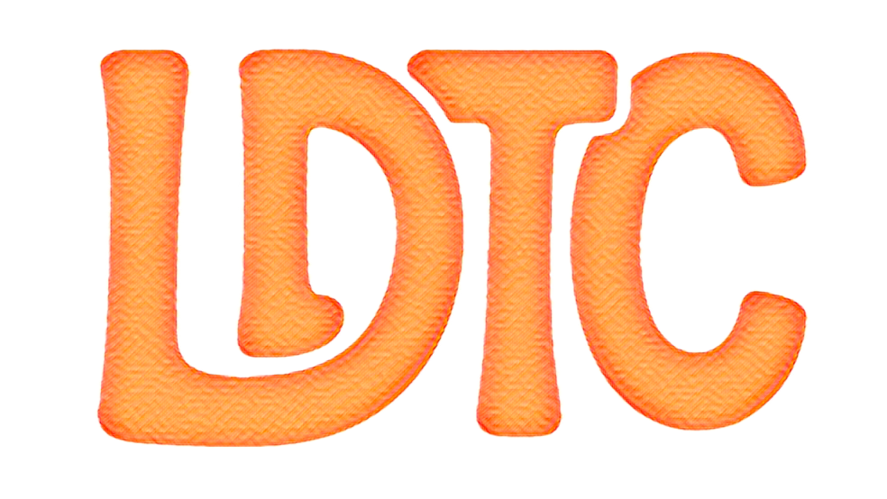

## LDTC

  

LDTC is a minimal, substrate‑agnostic verification harness for the Loop‑Dominance
Theory of Consciousness. It measures loop‑dominance (Lloop vs Lexchange), enforces
guardrails (enclave‑protected LREG, hash‑chained audit, Δt governance), runs
Ω‑perturbations, and evaluates NC1/SC1 with device‑signed indicators. It includes
a CLI, reproducible configs (R₀→R*), and an optional hardware adapter that ingests
real telemetry. For guides, API reference, and examples, see the
[docs](https://docs.ldtc.dev/).
